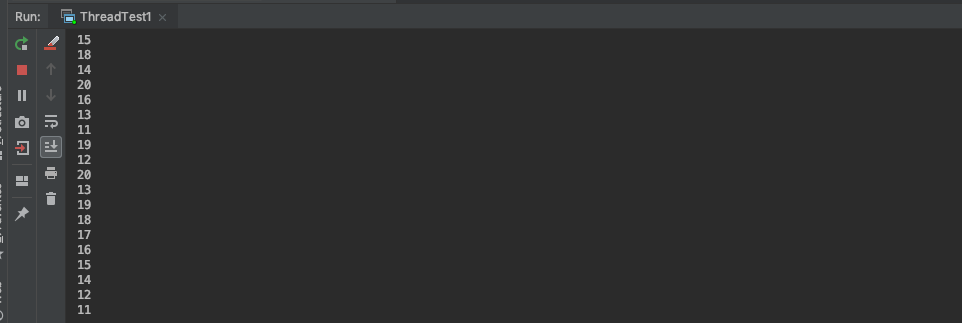
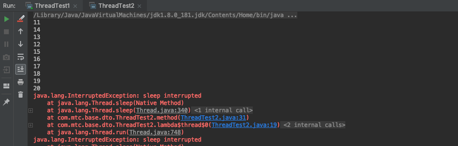
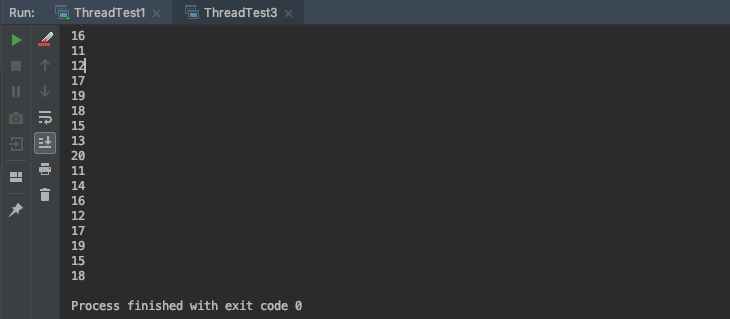
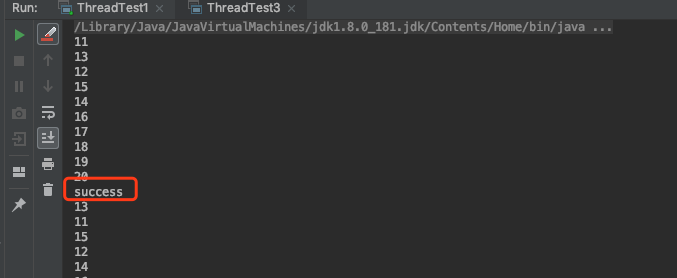
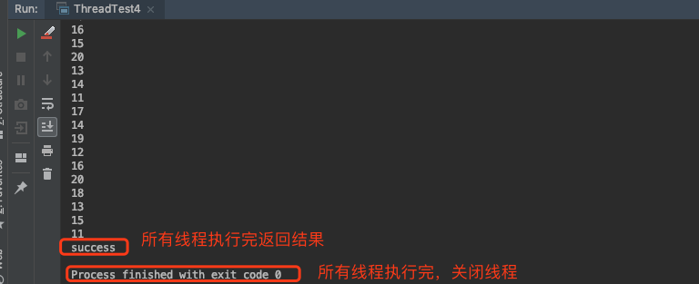
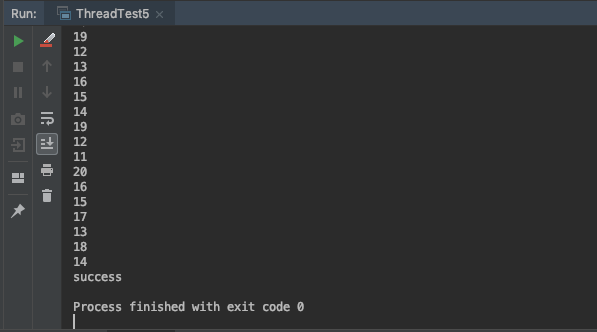

### 相关方法

* Executors.newFiexdThreadPool(10)

  创建一个固定数量的线程池

  * 当正在执行的任务数<线程数  -> 创建一个新的线程执行任务

  * <font color="red">当正在执行的任务数>=线程数  -> 将准备执行的任务放入到等待队列中去</font>

    当正在执行的任务数>=线程数，此时还有准备执行的任务要执行

    Executors.newFiexdThreadPool会无限吧任务加入到等待队列中去，直到内存溢出

    针对一般的情况newFiexdThreadPool就足够了

    如果碰到任务很多的情况，如双十一，秒杀等应用会将大量任务加入到等待队列里面，这个时候可以通过手工创建线程池的方式

    ``` java
    public ThreadPoolExecutor(int corePoolSize,
                              int maximumPoolSize,
                              long keepAliveTime,
                              TimeUnit unit,
                              BlockingQueue<Runnable> workQueue,
                              ThreadFactory threadFactory,
                              RejectedExecutionHandler handler);
    ```

    1. corePoolSize:线程池中的核心线程数
    2. maximumPoolSize:线程池中的最大线程数
    3. keepAliveTime:空闲时间，当线程池数量超过核心线程数时，多余的空闲线程存活的时间，即：这些线程多久被销毁
    4. unit:空闲时间的单位，可以是毫秒、秒、分钟、小时和天，等等
    5. workQueue:等待队列，线程池中的线程数超过核心线程数时，任务将放在等待队列，它是一个`BlockingQueue`类型的对象
    6. threadFactory:线程工厂，我们可以使用它来创建一个线程
    7. handler:拒绝策略，当线程池和等待队列都满了之后，需要通过该对象的回调函数进行回调处理

  * 当正在执行的任务数>=线程数 && 等待队列已满   ->会调用RejectedExecutionHandler拒绝策略

* shutdown()

  关闭线程池，等所有线程全部执行完毕后再进行关闭，当中不会将新的任务加入到等待队列中去

* shutdownNow()

  立即关闭线程池，不管还有没有线程正在执行

* awaitTermination(long timeout,TimeUnit unit)

  阻塞方法，等待线程执行完毕,该方法有最长等待时间

* CountDownLatch.await()

  阻塞方法，等待线程执行完毕，没有最长等待时间，必须等所有线程执行完

### 创建线程

#### 创建线程且不关闭

``` java
public class ThreadTest1 {
    public static void main(String[] args) throws InterruptedException {
        thread();
    }

    public static String thread() throws InterruptedException {
        ExecutorService executor = Executors.newFixedThreadPool(10);
        for(int i = 0 ; i<100;i++){
            executor.execute(()->{
                System.out.println(Thread.currentThread().getId());
                try {
                    method();
                } catch (InterruptedException e) {
                    e.printStackTrace();
                }
            });
        }
        return "success";
    }

    //方法执行时间为1秒
    public static void method() throws InterruptedException {
        TimeUnit.SECONDS.sleep(1);
    }
}
```

执行结果



所有任务执行完毕后线程还挂在那边，一直结束不了

#### shutdownNow

立即结束线程池

``` java
public class ThreadTest2 {
    public static void main(String[] args) throws InterruptedException {
        thread();
    }

    public static String thread() throws InterruptedException {
        ExecutorService executor = Executors.newFixedThreadPool(10);
        for(int i = 0 ; i<100;i++){
            executor.execute(()->{
                System.out.println(Thread.currentThread().getId());
                try {
                    method();
                } catch (InterruptedException e) {
                    e.printStackTrace();
                }
            });
        }
        executor.shutdownNow(); //立即关闭线程池
        return "success";
    }

    //方法执行时间为1秒
    public static void method() throws InterruptedException {
        TimeUnit.SECONDS.sleep(1);
    }
}

```

执行结果



任务还没全部执行完毕，线程池就被关闭了

#### shutdown

``` java
public class ThreadTest3 {
    public static void main(String[] args) throws InterruptedException {
        String result= thread();
        System.out.println(result);
    }

    public static String thread() throws InterruptedException {
        ExecutorService executor = Executors.newFixedThreadPool(10);
        for(int i = 0 ; i<100;i++){
            executor.execute(()->{
                System.out.println(Thread.currentThread().getId());
                try {
                    method();
                } catch (InterruptedException e) {
                    e.printStackTrace();
                }
            });
        }
        executor.shutdown(); //关闭线程池
        return "success";
    }

    //方法执行时间为1秒
    public static void method() throws InterruptedException {
        TimeUnit.SECONDS.sleep(1);
    }
}
```

执行结果



等待所有的任务任务执行完毕后关闭线程

#### awaitTermination

ThreadTest3中有个问题

``` java
 String result= thread();
```

如果需求希望是所有线程都执行完毕后返回一个执行成功的结果，而实际结果如下：



由于线程是异步执行的，所以返回结果后实际上还有线程正在执行

所以此时用到了awaitTermination

该方法会阻塞线程，并设置最大等待时间

``` java
public class ThreadTest4 {
    public static void main(String[] args) throws InterruptedException {
        String result= thread();
        System.out.println(result);
    }

    public static String thread() throws InterruptedException {
        ExecutorService executor = Executors.newFixedThreadPool(10);
        for(int i = 0 ; i<100;i++){
            executor.execute(()->{
                System.out.println(Thread.currentThread().getId());
                try {
                    method();
                } catch (InterruptedException e) {
                    e.printStackTrace();
                }
            });
        }
        executor.shutdown(); //关闭线程池
        if(!executor.awaitTermination(60,TimeUnit.SECONDS)){ //这里会阻塞线程，等所有线程都关闭了或超过最大等待时间后才会继续往下走
            /**
             * 实际应用中可能某些操作出现了一些错误，如死锁，http调用一直等待对方返回，这个时候我们可以设置一个最大等待时间
             * 如果超过了最大等待时间，还有线程没执行完毕的话，不管这个线程，直接关闭
             */
            executor.shutdownNow();
        }
        return "success";
    }

    //方法执行时间为1秒
    public static void method() throws InterruptedException {
        TimeUnit.SECONDS.sleep(1);
    }
}
```

执行结果



#### CountDownLatch.await

如果某些场景下，就是要等待所有线程执行完再进行后面的操作，不能强制关闭线程池

这个时候可以使用CountDownLatch.await

``` java
public class ThreadTest5 {
    public static void main(String[] args) throws InterruptedException {
        String result= thread();
        System.out.println(result);
    }

    public static String thread() throws InterruptedException {
        int taksSize = 100; //定义任务数量
        /**
         * 创建CountDownLatch，相当于一个计数器，每次执行完一个线程可以做-1操作
         */
        CountDownLatch latch = new CountDownLatch(taksSize);
        ExecutorService executor = Executors.newFixedThreadPool(10);
        for(int i = 0 ; i<taksSize;i++){
            executor.execute(()->{
                System.out.println(Thread.currentThread().getId());
                try {
                    method();
                } catch (InterruptedException e) {
                    e.printStackTrace();
                }finally {
                    latch.countDown(); //执行-1操作
                }
            });
        }
        latch.await(); //阻塞线程，必须等待所有线程执行完毕(-1操作直到0),才会继续往下执行
        executor.shutdown(); //关闭线程池
        //executor.shutdownNow(); 调用这个方法也可以，因为所有线程都已经执行完毕了
        return "success";
    }

    //方法执行时间为1秒
    public static void method() throws InterruptedException {
        TimeUnit.SECONDS.sleep(1);
    }
}
```

执行结果



