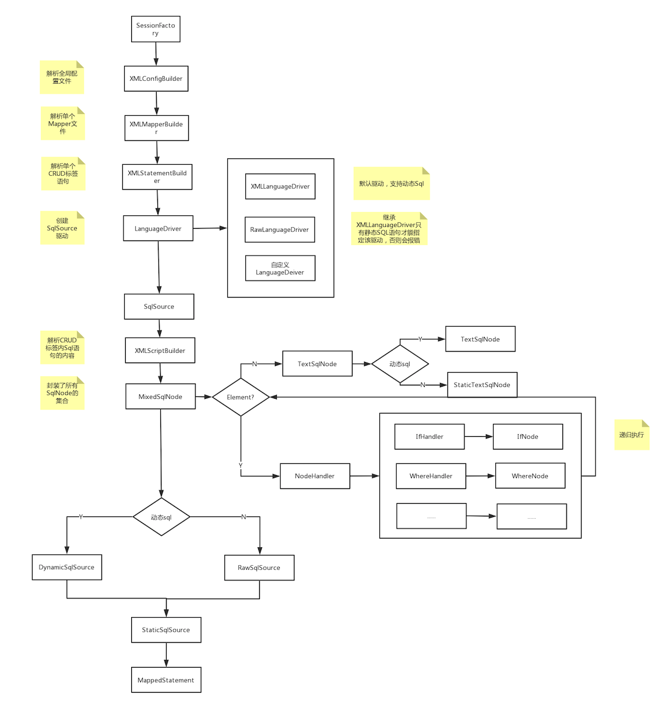
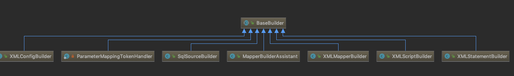

[toc]


## 架构

### 1. 整体架构


### 2.Sql执行流程


#### 四大组件

​	Executor

​	StatementHandler

​	ParameterHander

​	ResultSetHandler

#### Configuration

​	封装了全局配置文件和映射文件中的信息

#### BoundSql

​	组合模式，将解析后的Sql语句和解析出来的参数信息进行封装

``` java
public class BoundSql {

  private final String sql;
  private final List<ParameterMapping> parameterMappings;
  private final Object parameterObject;
  private final Map<String, Object> additionalParameters;
  private final MetaObject metaParameters;
  ...
}
```


#### MappedStatement

​	封装Select/Insert等CRUD标签的信息，包含入参类型信息和输出类型信息等

``` java
public final class MappedStatement {

  private String resource;
  private Configuration configuration;
  private String id;
  private Integer fetchSize;
  private Integer timeout;
  private StatementType statementType;
  private ResultSetType resultSetType;
  private SqlSource sqlSource;
  private Cache cache;
  private ParameterMap parameterMap;
  private List<ResultMap> resultMaps;
  private boolean flushCacheRequired;
  private boolean useCache;
  private boolean resultOrdered;
  private SqlCommandType sqlCommandType;
  private KeyGenerator keyGenerator;
  private String[] keyProperties;
  private String[] keyColumns;
  private boolean hasNestedResultMaps;
  private String databaseId;
  private Log statementLog;
  private LanguageDriver lang;
  private String[] resultSets;
  ...
}
```


### 3.Mapper执行流程


## 手写MyBatis框架

### 解析阶段

​	 

​	Resources

​	XmlConfigBuilder:解析全局配置文件，SqlMapper-Config.xml

​		XmlMapperBuilder:解析Mapper.xml文件

​			XMLStatementBuilder:解析mapper.xml文件中CRUD标签

​				XMLScriptBuilder:解析CRUD标签中动态sql语句标签的信息 如：<if><where>等

#### SqlSource

​	包含了CRUD标签中的信息，以及所有SqlNode(MixedSqlNode)的信息，通过SqlSource的api(apply方法)去获取最终的一条可执行的sql语句

​	该api最终是通过各个sqlnode处理，处理之后的结果，最后合并成一条sql语句

​	所有的SqlNode之间通过一个DynamicContext对象进行传递，该对象封装了一条完整的Sql语句,以及绑定参数的信息

​	先调用SqlNode的apply(DynamicContext),再调用DynamicContext.appendSql方法合并Sql

​	<font color="red">注意：该sql还需要再次进行#{}和${}的处理</font>


MixSqlNode

``` java
public class MixedSqlNode implements SqlNode {
  //所有SqlNode的集合，包含TextSqlNode和StaticTextSqlNode
  private final List<SqlNode> contents;

  public MixedSqlNode(List<SqlNode> contents) {
    this.contents = contents;
  }

  @Override
  public boolean apply(DynamicContext context) {
    for (SqlNode sqlNode : contents) {
      sqlNode.apply(context);
    }
    return true;
  }
}

```


TextSqlNode

``` java
  @Override
  public boolean apply(DynamicContext context) {
    GenericTokenParser parser = createParser(new BindingTokenParser(context, injectionFilter));
    context.appendSql(parser.parse(text));
    return true;
  }
```

DynamicContext

``` java
public class DynamicContext {
	...
  private final ContextMap bindings;
  private final StringBuilder sqlBuilder = new StringBuilder();
  
  public void appendSql(String sql) {
    sqlBuilder.append(sql);
    sqlBuilder.append(" ");
  }

  public String getSql() {
    return sqlBuilder.toString().trim();
  }
}
```

#### SqlNode

​	TextSqlNode:包含${}的sql语句

​	StaticTextSqlNode:什么都不带的Sql语句

​	StaticTextSqlNode:什么都不包含的SqlNode

​	IfSqlNode,WhereSqlNode等：包含<if><where>等标签的sqlnode

### 执行阶段

1. 先定访问接口（CRUD操作）

   SqlSession 拥有Configuration对象

   ```java
   <T> T selectOne(String statementId,Object param)  //获取单个对象sql
   <T> List<T> selectList(String statementId,Object param) //获取列表sql
   ```

   selectOne会执行JDBC代码

   ​	需要获取数据源连接（通过Configuration对象去获取connection）

   ​	获取执行的Sql语句 （通过statementId去Configuration对象中获取MappedStatement从而获取Sql语句）

   ​	需要获取入参信息

   ​	需要获取返回值，根据要求获取合适的返回值

2. 通过SqlSessionFactoryBuilder构建SqlSessionFactory

   ```java
   /**
   	*  1.通过输入流获取Configuration对象
   	*  2.然后再生成SqlSessionFactory
   	*/
   SqlSessionFactory factory = SqlSessionFactoryBuilder.build(InputStream is);
   ```

   

3. 使用工厂获取SqlSession,这个工厂就是SqlSessionFactory(Configuration)

   ```java
   //通过SqlSessionFactory.openSesion()方法获取SqlSession
   SqlSession sqlSession = factory.openSession();
   ```

#### Executor

​	用来专门实现JDBC操作的接口

​	CachingExecutor:处理二级缓存

​	<font color="red">BaseExecutor:处理一级缓存</font>

> ​		BaseExecutor中默认包含了一级缓存操作，就是内部有个map存储了sql一级所对应的结果集
>
> ​		如果map中没有对应的结果集，则交由下一级（SimpleExecutor）执行JDBC通过数据库操作后再放入map中

​		<font color="red">SimpleExecutor:执行简单的JDBC操作</font>

​		BatchExecutor:执行批处理的JDBC操作

​		ReuseExecutor:可重复使用的Executor

## 源码阅读

### 解析阶段

#### 解析全局配置文件(MyBatis-Config.xml)

``` java
SqlSessionFactoryBuilder#build(InputStream is)	//根据输入流构造SqlSessionFactory
 	XMLConfigBuilder(inutStream,enviroment,properties) //用于解析Mybatis-config.xml文件的类
  XMLConfigBuilder(XPathParser(inputStream),enviroment,properties)//使用XPathParser解析inputstream
  	XPathParser.createDocument(inputSource) //解析XML并创建Document对象
  XMLConfigBuilder#parse() //调用parse方法，返回一个Configuration对象
  		XMLConfigBuilder#parseConfiguration(XNode root) //解析xml文件内容并设置到Configration对象中去
//返回一个DefaultSqlSesionFactory,该类为SqlSesionFactory的默认实现
```

##### SqlSeesionFactory.build()

``` java
 public SqlSessionFactory build(InputStream inputStream, String environment, Properties properties) {
    try {
      //创建XMLConfigBuilder，该类用于解析Mybatis全局配置文件
      XMLConfigBuilder parser = new XMLConfigBuilder(inputStream, environment, properties);
      //调用parse方法进行解析XML文件
      return build(parser.parse());
    } catch (Exception e) {
      throw ExceptionFactory.wrapException("Error building SqlSession.", e);
    } finally {
      ErrorContext.instance().reset();
      try {
        inputStream.close();
      } catch (IOException e) {
        // Intentionally ignore. Prefer previous error.
      }
    }
  }
//返回SqlSessionFactory默认实现(DefaultSqlSessionFactory)
public SqlSessionFactory build(Configuration config) {
  return new DefaultSqlSessionFactory(config);
}
```

##### XMLConfigBuilder



构造方法

``` java
public XMLConfigBuilder(InputStream inputStream, String environment, Properties props) {
    //new XPathParser 用来具体解析xml
  	this(new XPathParser(inputStream, true, props, new XMLMapperEntityResolver()), environment, 		props);
}
private XMLConfigBuilder(XPathParser parser, String environment, Properties props) {
    super(new Configuration());
    ErrorContext.instance().resource("SQL Mapper Configuration");
    this.configuration.setVariables(props);
    this.parsed = false;
    this.environment = environment;
    this.parser = parser;
}
```

parse

``` java
  public Configuration parse() {
    if (parsed) {
      throw new BuilderException("Each XMLConfigBuilder can only be used once.");
    }
    parsed = true;
    //XPath语法
    //调用XPathParser.evalNode()方法查询某个节点，这里查找configuration这个根节点
    //调用parseConfiguration解析configuration标签下的所有节点，并将内容设置到Configuration对象中
    parseConfiguration(parser.evalNode("/configuration"));
    return configuration;
  }
```


parseConfiguration

``` java
 private void parseConfiguration(XNode root) {
    try {
      //issue #117 read properties first
      propertiesElement(root.evalNode("properties"));
      Properties settings = settingsAsProperties(root.evalNode("settings"));
      loadCustomVfs(settings);
      loadCustomLogImpl(settings);
      typeAliasesElement(root.evalNode("typeAliases"));
      pluginElement(root.evalNode("plugins"));
      objectFactoryElement(root.evalNode("objectFactory"));
      objectWrapperFactoryElement(root.evalNode("objectWrapperFactory"));
      reflectorFactoryElement(root.evalNode("reflectorFactory"));
      settingsElement(settings);
      // read it after objectFactory and objectWrapperFactory issue #631
      environmentsElement(root.evalNode("environments"));
      databaseIdProviderElement(root.evalNode("databaseIdProvider"));
      typeHandlerElement(root.evalNode("typeHandlers"));
      //解析mappers标签
      mapperElement(root.evalNode("mappers"));
    } catch (Exception e) {
      throw new BuilderException("Error parsing SQL Mapper Configuration. Cause: " + e, e);
    }
  }
```

##### XPathParser

构造方法

``` java
public XPathParser(InputStream inputStream, boolean validation, Properties variables, 			    									 EntityResolver entityResolver) {
    commonConstructor(validation, variables, entityResolver);
  	//根据输入流创建Document对象（Xml文件对象）
  	//将inputStream封装成一个InputSource对象
    this.document = createDocument(new InputSource(inputStream));
}
```

#### 解析mappers标签及mapper文件

``` java
XMLConfigBuilder#mapperElement(root.evalNode("mappers")) //解析mappers标签
  XMLMapperBuilder#构造方法 //新增XMLMapperBuilder构造函数，解析mapper文件中的内容，同样也是BaseBuilder的子类
  XMLMapperBuilder#parse() //解析mapper文件入口
  	configurationElement(parser.evalNode("/mapper")) //解析mapper标签
  		buildStatementFromContext(context.evalNodes("select|insert|update|delete")) //解析CRUD标签
  			XMLStatementBuilder#构造方法	//解析CRUD标签的类
  			XMLStatementBuilder#parseStatementNode()  //解析CRUD标签入口
  				MapperBuilderAssistant#addMappedStatement() //创建MappedStatment对象
```

##### XMLConfigBuilder

###### mapperElement

``` java
private void mapperElement(XNode parent) throws Exception {
    if (parent != null) {
      for (XNode child : parent.getChildren()) {
        //包扫描，将package属性指定的包下面的类添加到configuration中的mappers集合中
        if ("package".equals(child.getName())) {
          String mapperPackage = child.getStringAttribute("name");
          configuration.addMappers(mapperPackage);
        } else {
          //有三种方式加载mapper文件
          //resource方式，指定资源文件夹中mapper.xml的文件的路径
         	//url方式，指定远程的mapper.xml的路径
          //class方式，指定类的路径
          //以上3中方式是互斥的
          String resource = child.getStringAttribute("resource");
          String url = child.getStringAttribute("url");
          String mapperClass = child.getStringAttribute("class");
          if (resource != null && url == null && mapperClass == null) {
            ErrorContext.instance().resource(resource);
            InputStream inputStream = Resources.getResourceAsStream(resource);
            //解析单个mapper.xml文件中的内容
            XMLMapperBuilder mapperParser = new XMLMapperBuilder(inputStream, configuration, resource, configuration.getSqlFragments());
            mapperParser.parse();
          } else if (resource == null && url != null && mapperClass == null) {
            ErrorContext.instance().resource(url);
            InputStream inputStream = Resources.getUrlAsStream(url);
            XMLMapperBuilder mapperParser = new XMLMapperBuilder(inputStream, configuration, url, configuration.getSqlFragments());
            mapperParser.parse();
          } else if (resource == null && url == null && mapperClass != null) {
            Class<?> mapperInterface = Resources.classForName(mapperClass);
            configuration.addMapper(mapperInterface);
          } else {
            throw new BuilderException("A mapper element may only specify a url, resource or class, but not more than one.");
          }
        }
      }
    }
  }
```

##### XMLMapperBuilder

###### parse

``` java
  public void parse() {
    if (!configuration.isResourceLoaded(resource)) {
      //解析mapper.xml文件中mapper根标签下的内容
      configurationElement(parser.evalNode("/mapper"));
      configuration.addLoadedResource(resource);
      bindMapperForNamespace();
    }

    parsePendingResultMaps();
    parsePendingCacheRefs();
    parsePendingStatements();
  }
```

######  configurationElement

``` java
 private void configurationElement(XNode context) {
    try {
      //解析namespace
      String namespace = context.getStringAttribute("namespace");
      if (namespace == null || namespace.equals("")) {
        throw new BuilderException("Mapper's namespace cannot be empty");
      }
      builderAssistant.setCurrentNamespace(namespace);
      cacheRefElement(context.evalNode("cache-ref"));
      cacheElement(context.evalNode("cache"));
      //解析parameterMap
      parameterMapElement(context.evalNodes("/mapper/parameterMap"));
      //解析resultMap
      resultMapElements(context.evalNodes("/mapper/resultMap"));
      //解析sql标签内容
      sqlElement(context.evalNodes("/mapper/sql"));
      //解析各个CRUD标签
      buildStatementFromContext(context.evalNodes("select|insert|update|delete"));
    } catch (Exception e) {
      throw new BuilderException("Error parsing Mapper XML. The XML location is '" + resource + "'. Cause: " + e, e);
    }
  }
```

###### buildStatementFromContext

``` java
private void buildStatementFromContext(List<XNode> list, String requiredDatabaseId) {
    for (XNode context : list) {
      //解析单个CRUD标签，并创建一个MappedStatement对象
      final XMLStatementBuilder statementParser = new XMLStatementBuilder(configuration, builderAssistant, context, requiredDatabaseId);
      try {
        statementParser.parseStatementNode();
      } catch (IncompleteElementException e) {
        configuration.addIncompleteStatement(statementParser);
      }
    }
  }
```

##### XMLStatementBuilder

###### parseStatementNode

```` java
public void parseStatementNode() {
    String id = context.getStringAttribute("id");
    String databaseId = context.getStringAttribute("databaseId");

    if (!databaseIdMatchesCurrent(id, databaseId, this.requiredDatabaseId)) {
      return;
    }

    Integer fetchSize = context.getIntAttribute("fetchSize");
    Integer timeout = context.getIntAttribute("timeout");
    String parameterMap = context.getStringAttribute("parameterMap");
    String parameterType = context.getStringAttribute("parameterType");
    Class<?> parameterTypeClass = resolveClass(parameterType);
    String resultMap = context.getStringAttribute("resultMap");
    String resultType = context.getStringAttribute("resultType");
    String lang = context.getStringAttribute("lang");
  	//获取语言驱动，默认使用XMLLanguageDriver
  	//XMLLanguageDriver就是通过xml配置文件来创建SqlSource
  	//用户也可以自定义实现LanguageDriver
  	//https://blog.csdn.net/w_yunlong/article/details/79201509
    LanguageDriver langDriver = getLanguageDriver(lang);

    Class<?> resultTypeClass = resolveClass(resultType);
    String resultSetType = context.getStringAttribute("resultSetType");
  	//获取StatementType，如果参数中没指定StatmentType,则默认使用Prepared
    StatementType statementType = StatementType.valueOf(context.getStringAttribute("statementType", StatementType.PREPARED.toString()));
    ResultSetType resultSetTypeEnum = resolveResultSetType(resultSetType);

    String nodeName = context.getNode().getNodeName();
    SqlCommandType sqlCommandType = SqlCommandType.valueOf(nodeName.toUpperCase(Locale.ENGLISH));
    boolean isSelect = sqlCommandType == SqlCommandType.SELECT;
    boolean flushCache = context.getBooleanAttribute("flushCache", !isSelect);
    boolean useCache = context.getBooleanAttribute("useCache", isSelect);
    boolean resultOrdered = context.getBooleanAttribute("resultOrdered", false);

    // Include Fragments before parsing
    XMLIncludeTransformer includeParser = new XMLIncludeTransformer(configuration, builderAssistant);
    includeParser.applyIncludes(context.getNode());

    // Parse selectKey after includes and remove them.
    processSelectKeyNodes(id, parameterTypeClass, langDriver);

    // Parse the SQL (pre: <selectKey> and <include> were parsed and removed)
    SqlSource sqlSource = langDriver.createSqlSource(configuration, context, parameterTypeClass);
    String resultSets = context.getStringAttribute("resultSets");
    String keyProperty = context.getStringAttribute("keyProperty");
    String keyColumn = context.getStringAttribute("keyColumn");
    KeyGenerator keyGenerator;
    String keyStatementId = id + SelectKeyGenerator.SELECT_KEY_SUFFIX;
    keyStatementId = builderAssistant.applyCurrentNamespace(keyStatementId, true);
    if (configuration.hasKeyGenerator(keyStatementId)) {
      keyGenerator = configuration.getKeyGenerator(keyStatementId);
    } else {
      keyGenerator = context.getBooleanAttribute("useGeneratedKeys",
          configuration.isUseGeneratedKeys() && SqlCommandType.INSERT.equals(sqlCommandType))
          ? Jdbc3KeyGenerator.INSTANCE : NoKeyGenerator.INSTANCE;
    }

  	//创建MappedStatement对象
  	//MapperBuilderAssistant相当于一个助手类，用于创建MappedStatement对象，以及其中包含的ParameterMapping集合
    builderAssistant.addMappedStatement(id, sqlSource, statementType, sqlCommandType,
        fetchSize, timeout, parameterMap, parameterTypeClass, resultMap, resultTypeClass,
        resultSetTypeEnum, flushCache, useCache, resultOrdered,
        keyGenerator, keyProperty, keyColumn, databaseId, langDriver, resultSets);
  }
````


#### 创建SqlSource

``` java
XMLLanguageDriver#createSqlSource(入参)  //创建SqlSource
  XMLScriptBuilder#构造方法  //用于解析单个CRUD标签中内容的类
  XMLScriptBuilder#parseScriptNode()  //解析单个CRUD标签
  	parseDynamicTags() //解析动态标签，并返回MixedSqlNode类，该类封装了单个CURD标签中所有SqlNode的集合，包含TextSqlNode以及StaticTextSqlNode
  	DynamicSqlSource#构造方法	//处理Sql信息中包含${}及动态Sql标签的类
  		//构造方法只做赋值，解析sql语句在getBoundSql方法中
  		//原因是该类是处理${}及动态Sql标签，所以每次传入的参数不同会导致Sql语句不同，所以在执行阶段才进行sql语句的解析
  	RawSqlSource#构造方法		//处理Sql信息中包含#{}标签的类
  		DynamicContext#构造方法 //封装了包含#{}的sql语句以及对应参数的类
  		SqlSourceBuilder#构造方法	//用于创建SqlSource的类
  			parse(入参) //解析CRUD
  				ParameterMappingTokenHandler#构造函数
  				GenericTokenParser#构造函数(open,close,handler) //根据open，close匹配sql中带有#{}的部分，并交由ParameterMappingTokenHandler处理
  				GenericTokenParser#parse(originalSql) //用来解析sql中带有#{}的部分
  				StaticSqlSource#构造函数 //返回StaticSqlSource对象,该对象是最终创建的SqlSource对象，此时的sql已经解析完毕，只包含?号的Sql语句
  		
```

##### XMLLanguageDriver

默认的LanguageDriver

###### createSqlSource

``` java
//1.通过xml解析CRUD标签调用该方法创建SqlSource
@Override
public SqlSource createSqlSource(Configuration configuration, XNode script, Class<?> 				parameterType) {
  	//解析单个CRUD标签中的内容，并返回SqlSource
    XMLScriptBuilder builder = new XMLScriptBuilder(configuration, script, parameterType);
    return builder.parseScriptNode();
}

//2.通过注解方式写Sql语句调用该方法创建SqlSource
public SqlSource createSqlSource(Configuration configuration, String script, Class<?> parameterType) {
    // issue #3
  	//<script>标签用于通过注解编写sql语句时，可以通过script标签将类似于写xml的方式写进注解中
  	//https://www.cnblogs.com/goloving/p/9241421.html
  	//如果包含<script>标签，则需要解析script中的内容
    if (script.startsWith("<script>")) {
      XPathParser parser = new XPathParser(script, false, configuration.getVariables(), new XMLMapperEntityResolver());
      //因为<script>标签中的内容相当于是xml中的内容，所以这里调用的是上面1.这个创建SqlSource方法
      return createSqlSource(configuration, parser.evalNode("/script"), parameterType);
    } else {
      // issue #127
      //解析Sql语句中的内容，判断是否包含${}（这里没有动态标签，因为是注解写的Sql）
      script = PropertyParser.parse(script, configuration.getVariables());
      TextSqlNode textSqlNode = new TextSqlNode(script);
      //同XMLScriptBuilder.parseScriptNode中的方法一样
      if (textSqlNode.isDynamic()) {
        return new DynamicSqlSource(configuration, textSqlNode);
      } else {
        return new RawSqlSource(configuration, script, parameterType);
      }
    }
}
```

##### RawLanguageDriver

XmlLanguageDriver的子类，自能适用于不包含${}及动态Sql语句的情况，否则会报错

``` java
 /**
 * As of 3.2.4 the default XML language is able to identify static statements
 一般不用Raw除非你确认你的SQL语句中不包含${}及动态标签
 * and create a {@link RawSqlSource}. So there is no need to use RAW unless you
 * want to make sure that there is not any dynamic tag for any reason.
 *
 * @since 3.2.0
 * @author Eduardo Macarron
 */
public class RawLanguageDriver extends XMLLanguageDriver {

  @Override
  public SqlSource createSqlSource(Configuration configuration, XNode script, Class<?> parameterType) {
    SqlSource source = super.createSqlSource(configuration, script, parameterType);
    checkIsNotDynamic(source);
    return source;
  }

  @Override
  public SqlSource createSqlSource(Configuration configuration, String script, Class<?> parameterType) {
    SqlSource source = super.createSqlSource(configuration, script, parameterType);
    checkIsNotDynamic(source);
    return source;
  }

  //检查是否包含动态标签，如果包含则直接报错
  private void checkIsNotDynamic(SqlSource source) {
    if (!RawSqlSource.class.equals(source.getClass())) {
      throw new BuilderException("Dynamic content is not allowed when using RAW language");
    }
  }

}

```


##### XMLScriptBuilder

###### parseScriptNode

``` java
 public SqlSource parseScriptNode() {
   	//处理动态标签，包含${}及动态Sql标签，返回一个MixedSqlNode
    //MixedSqlNode中封装了TextSqlNode和StaticSqlNode的集合
    MixedSqlNode rootSqlNode = parseDynamicTags(context);
    SqlSource sqlSource = null;
    if (isDynamic) {
      //如果是动态sql语句，则创建DynamicSqlSource
      sqlSource = new DynamicSqlSource(configuration, rootSqlNode);
    } else {
      //反之则创建RawSqlSource
      sqlSource = new RawSqlSource(configuration, rootSqlNode, parameterType);
    }
    return sqlSource;
 }
```


###### parseDynamicTags

``` java
protected MixedSqlNode parseDynamicTags(XNode node) {
    List<SqlNode> contents = new ArrayList<>();
    NodeList children = node.getNode().getChildNodes();
    for (int i = 0; i < children.getLength(); i++) {
      XNode child = node.newXNode(children.item(i));
      if (child.getNode().getNodeType() == Node.CDATA_SECTION_NODE || 			         child.getNode().getNodeType() == Node.TEXT_NODE) {
        String data = child.getStringBody("");
        //如果节点中只是文本内容，不包含动态Sql标签，则创建TextSqlNode
        TextSqlNode textSqlNode = new TextSqlNode(data);、
        //TextSqlNode中的isDynamic方法回去判断该文本中是否包含${}
        if (textSqlNode.isDynamic()) {
          contents.add(textSqlNode);
          isDynamic = true;
        } else {
          //如果不包含${}，则创建一个StaticTextSqlNode
          contents.add(new StaticTextSqlNode(data));
        }
      } else if (child.getNode().getNodeType() == Node.ELEMENT_NODE) { // issue #628
        //如果当前的节点是个Element(动态Sql标签)，则设置isDynamic为true
        String nodeName = child.getNode().getNodeName();
        //并交由NodeHandler去处理
        //每个动态标签都有相对应的NodeHandler去处理如:IfHandler,WhereHandler
        NodeHandler handler = nodeHandlerMap.get(nodeName);
        if (handler == null) {
          throw new BuilderException("Unknown element <" + nodeName + "> in SQL statement.");
        }
        //处理动态标签
        handler.handleNode(child, contents);
        isDynamic = true;
      }
    }
    return new MixedSqlNode(contents);
  }
```

###### initNodeHandlerMap

``` java
 private void initNodeHandlerMap() {
    nodeHandlerMap.put("trim", new TrimHandler());
    nodeHandlerMap.put("where", new WhereHandler());
    nodeHandlerMap.put("set", new SetHandler());
    nodeHandlerMap.put("foreach", new ForEachHandler());
    nodeHandlerMap.put("if", new IfHandler());
    nodeHandlerMap.put("choose", new ChooseHandler());
    nodeHandlerMap.put("when", new IfHandler());
    nodeHandlerMap.put("otherwise", new OtherwiseHandler());
    nodeHandlerMap.put("bind", new BindHandler());
  }
```

###### IfHandler

``` java
 private class IfHandler implements NodeHandler {
    public IfHandler() {
      // Prevent Synthetic Access
    }

    @Override
    public void handleNode(XNode nodeToHandle, List<SqlNode> targetContents) {
      //同样处理动态标签，看<if>标签下是否含有子的动态标签
      MixedSqlNode mixedSqlNode = parseDynamicTags(nodeToHandle);
      String test = nodeToHandle.getStringAttribute("test");
      //创建相对应的SqlNode
      IfSqlNode ifSqlNode = new IfSqlNode(mixedSqlNode, test);
      targetContents.add(ifSqlNode);
    }
  }
```

#####  IfSqlNode

``` java
public class IfSqlNode implements SqlNode {
  private final ExpressionEvaluator evaluator;
  private final String test;
  private final SqlNode contents;

  public IfSqlNode(SqlNode contents, String test) {
    this.test = test;
    this.contents = contents;
    this.evaluator = new ExpressionEvaluator();
  }

  @Override
  public boolean apply(DynamicContext context) {
    //如果test中的条件成立，则拼接sql语句
    if (evaluator.evaluateBoolean(test, context.getBindings())) {
      contents.apply(context);
      return true;
    }
    return false;
  }

}
```

##### RawSqlSource

``` java
public class RawSqlSource implements SqlSource {

  private final SqlSource sqlSource;

  public RawSqlSource(Configuration configuration, SqlNode rootSqlNode, Class<?> parameterType) {
    this(configuration, getSql(configuration, rootSqlNode), parameterType);
  }

  //由于RawSqlSource不包含${}及动态Sql标签，所以每次形成的Sql语句是相同的
  //所以再构造方法中就可以创建生成对应StaticSqlSource
  public RawSqlSource(Configuration configuration, String sql, Class<?> parameterType) {
    SqlSourceBuilder sqlSourceParser = new SqlSourceBuilder(configuration);
    Class<?> clazz = parameterType == null ? Object.class : parameterType;
    //这里生成的就是一个StaticSqlSource,并将#{}替换成?
    sqlSource = sqlSourceParser.parse(sql, clazz, new HashMap<>());
  }

  private static String getSql(Configuration configuration, SqlNode rootSqlNode) {
    DynamicContext context = new DynamicContext(configuration, null);
    rootSqlNode.apply(context);
    return context.getSql();
  }

  @Override
  public BoundSql getBoundSql(Object parameterObject) {
    return sqlSource.getBoundSql(parameterObject);
  }

}
```


##### DynamicSqlSource

``` java
public class DynamicSqlSource implements SqlSource {

  private final Configuration configuration;
  private final SqlNode rootSqlNode;

  //DynamicSqlSource包含${}及动态Sql标签，所以每次生成的Sql可能不同
  //所以初始化构造方法中只做赋值
  public DynamicSqlSource(Configuration configuration, SqlNode rootSqlNode) {
    this.configuration = configuration;
    this.rootSqlNode = rootSqlNode;
  }

  //然后在getBoundSql中才进行StaticSqlSource的处理
  @Override
  public BoundSql getBoundSql(Object parameterObject) {
    DynamicContext context = new DynamicContext(configuration, parameterObject);
    rootSqlNode.apply(context);
    SqlSourceBuilder sqlSourceParser = new SqlSourceBuilder(configuration);
    Class<?> parameterType = parameterObject == null ? Object.class : parameterObject.getClass();
    SqlSource sqlSource = sqlSourceParser.parse(context.getSql(), parameterType, context.getBindings());
    BoundSql boundSql = sqlSource.getBoundSql(parameterObject);
    for (Map.Entry<String, Object> entry : context.getBindings().entrySet()) {
      boundSql.setAdditionalParameter(entry.getKey(), entry.getValue());
    }
    return boundSql;
  }

}
```


### 执行阶段

#### openSsession

``` java
DefaultSqlSessionFactory#openSession //入口
  openSessionFromDataSource
  	Configuration#newExecutor //创建Executor
  	//默认创建CachingExecutor,如果未配置过二级缓存，则创建SimpleExecutor
  	//SimpleExecutor是BaseExecutor的子类，里面包含了一级缓存
  	//一级缓存实际上就是个Map
```

##### DefaultSqlSessionFactory

###### openSessionFromDataSource

``` java
  @Override
public SqlSession openSession() {
   //默认autoCommit为false
   return openSessionFromDataSource(configuration.getDefaultExecutorType(), null, false);
}
 
private SqlSession openSessionFromDataSource(ExecutorType execType, TransactionIsolationLevel level, boolean autoCommit) {
    Transaction tx = null;
    try {
      final Environment environment = configuration.getEnvironment();
      final TransactionFactory transactionFactory = getTransactionFactoryFromEnvironment(environment);
      tx = transactionFactory.newTransaction(environment.getDataSource(), level, autoCommit);
      //创建Executor,这里创建的为CachingExecutor
      final Executor executor = configuration.newExecutor(tx, execType);
      //返回一个DefaultSqlSession
      return new DefaultSqlSession(configuration, executor, autoCommit);
    } catch (Exception e) {
      closeTransaction(tx); // may have fetched a connection so lets call close()
      throw ExceptionFactory.wrapException("Error opening session.  Cause: " + e, e);
    } finally {
      ErrorContext.instance().reset();
    }
  }

```

##### Configuration

###### newExecutor

``` java
......
//默认使用SimpleExecutor
protected ExecutorType defaultExecutorType = ExecutorType.SIMPLE;
//默认支持二级缓存
protected boolean cacheEnabled = true;
......
public Executor newExecutor(Transaction transaction, ExecutorType executorType) {
  	//如果传入的executor为null，则使用defaultExecutorType（SimpleExecutor）
    executorType = executorType == null ? defaultExecutorType : executorType;
		//如果还为空，则直接使用SimpleExecutor
  	executorType = executorType == null ? ExecutorType.SIMPLE : executorType;
    Executor executor;
    if (ExecutorType.BATCH == executorType) {
      executor = new BatchExecutor(this, transaction);
    } else if (ExecutorType.REUSE == executorType) {
      executor = new ReuseExecutor(this, transaction);
    } else {
      executor = new SimpleExecutor(this, transaction);
    }
  	//如果支持二级缓存则创建CacheingExecutor
    if (cacheEnabled) {
      //创建CachingExecutor并将SimpleExecutor传入CachingExecutor的构造函数中
      //实际上虽然默认支持二级缓存，但是如果没有配置相应的二级缓存的话，最终还是用的SimpleExecutor
      executor = new CachingExecutor(executor);
    }
    executor = (Executor) interceptorChain.pluginAll(executor);
    return executor;
  }
```

#### 执行selectList方法

``` java
DefaultSqlSession#selectList
  CachingExecutor#query //先执行CachingExecutor的query
  	BaseExecutor#query //如果未配置二级缓存内容，则调用BaseExecutor的query方法
  		queryFromDatabase  //如果一级缓存中没有对应的内容，则调用该方法去数据库中查询，完毕后将结果集放入一级缓存中
  			SimpleExecutor#doQuery //具体查询查询数据库操作，包括建立连接，设置参数，执行Sql，设置结果集，释放连接
```

##### DefaultSqlSession

###### selectList

``` java
  @Override
 public <E> List<E> selectList(String statement, Object parameter, RowBounds rowBounds) {
    try {
      MappedStatement ms = configuration.getMappedStatement(statement);
      //调用CachingExecutor的query方法
      return executor.query(ms, wrapCollection(parameter), rowBounds, Executor.NO_RESULT_HANDLER);
    } catch (Exception e) {
      throw ExceptionFactory.wrapException("Error querying database.  Cause: " + e, e);
    } finally {
      ErrorContext.instance().reset();
    }
  }
```

##### CachingExecutor

###### query

``` java
public CachingExecutor(Executor delegate) {
   //委托类，在Configuration.newExecutor中是将SimpleExecutor传给CachingExecutor
   //如果未配置二级缓存，则交由委托类继续去执行query方法
   this.delegate = delegate; 
   delegate.setExecutorWrapper(this);
}

@Override
public <E> List<E> query(MappedStatement ms, Object parameterObject, RowBounds rowBounds, 	 ResultHandler resultHandler, CacheKey key, BoundSql boundSql)
      throws SQLException {
		//是否配置了二级缓存
    Cache cache = ms.getCache();
    if (cache != null) {
      flushCacheIfRequired(ms);
      if (ms.isUseCache() && resultHandler == null) {
        ensureNoOutParams(ms, boundSql);
        @SuppressWarnings("unchecked")
        List<E> list = (List<E>) tcm.getObject(cache, key);
        if (list == null) {
          //如果二级缓存内容为空，则交由委托类执行query方法
          list = delegate.query(ms, parameterObject, rowBounds, resultHandler, key, boundSql);
          //将委托类执行query方法后的结果集放置到二级缓存中去
          tcm.putObject(cache, key, list); // issue #578 and #116
        }
        return list;
      }
    }
  	//如果没配置二级缓存，则直接交由委托类去处理查询
    return delegate.query(ms, parameterObject, rowBounds, resultHandler, key, boundSql);
}
```

##### BaseExecutor

###### query

``` java
  @Override
  public <E> List<E> query(MappedStatement ms, Object parameter, RowBounds rowBounds, ResultHandler resultHandler, CacheKey key, BoundSql boundSql) throws SQLException {
    ErrorContext.instance().resource(ms.getResource()).activity("executing a query").object(ms.getId());
    if (closed) {
      throw new ExecutorException("Executor was closed.");
    }
    if (queryStack == 0 && ms.isFlushCacheRequired()) {
      clearLocalCache();
    }
    List<E> list;
    try {
      queryStack++;
      //从一级缓存中获取结果集
      list = resultHandler == null ? (List<E>) localCache.getObject(key) : null;
      if (list != null) {
        handleLocallyCachedOutputParameters(ms, key, parameter, boundSql);
      } else {
        //如果结果集为空，则直接从数据库中获取数据
        list = queryFromDatabase(ms, parameter, rowBounds, resultHandler, key, boundSql);
      }
    } finally {
      queryStack--;
    }
    if (queryStack == 0) {
      for (DeferredLoad deferredLoad : deferredLoads) {
        deferredLoad.load();
      }
      // issue #601
      deferredLoads.clear();
      if (configuration.getLocalCacheScope() == LocalCacheScope.STATEMENT) {
        // issue #482
        clearLocalCache();
      }
    }
    return list;
  }
```

###### queryFromDataBase

``` java
private <E> List<E> queryFromDatabase(MappedStatement ms, Object parameter, RowBounds rowBounds, ResultHandler resultHandler, CacheKey key, BoundSql boundSql) throws SQLException {
    List<E> list;
    localCache.putObject(key, EXECUTION_PLACEHOLDER);
    try {
      //调用SimpleExecutor的doQuery方法从数据库中查询数据
      list = doQuery(ms, parameter, rowBounds, resultHandler, boundSql);
    } finally {
      localCache.removeObject(key);
    }
  	//将数据库中查询的数据放回到一级缓存中去
    localCache.putObject(key, list);
    if (ms.getStatementType() == StatementType.CALLABLE) {
      localOutputParameterCache.putObject(key, parameter);
    }
    return list;
 }
```

##### SimpleExecutor

###### doQuery

``` java
@Override
public <E> List<E> doQuery(MappedStatement ms, Object parameter, RowBounds rowBounds, ResultHandler resultHandler, BoundSql boundSql) throws SQLException {
    Statement stmt = null;
    try {
      Configuration configuration = ms.getConfiguration();
      //创建StatmentHandler
      StatementHandler handler = configuration.newStatementHandler(wrapper, ms, parameter, rowBounds, resultHandler, boundSql);
      //获取连接，并设置参数
      stmt = prepareStatement(handler, ms.getStatementLog());
      //执行Sql语句并处理返回结果
      return handler.query(stmt, resultHandler);
    } finally {
      //释放连接等操作
      closeStatement(stmt);
    }
}
```

###### prepareStatment

``` java
private Statement prepareStatement(StatementHandler handler, Log statementLog) throws SQLException {
    Statement stmt;
  	//获取连接
    Connection connection = getConnection(statementLog);
  	//获取Statment,根据不同类型的StatmentHandler获取不同的Statment,如PrepareStatment
    stmt = handler.prepare(connection, transaction.getTimeout());
  	//设置参数
    handler.parameterize(stmt);
    return stmt;
 }
```

#### 创建StatmentHandler

``` java
Configuration#newStatmentHandler //创建StatmentHandler
  RoutingStatmentHandler#构造函数 //组合类，里面有个委托对象，根据MappedStatment中的StatmentType委托给不同的StatmentHandler去调用响应的方法
```

##### Configuration

###### newStatmentHandler

``` java
public StatementHandler newStatementHandler(Executor executor, MappedStatement mappedStatement, Object parameterObject, RowBounds rowBounds, ResultHandler resultHandler, BoundSql boundSql) {
    //新建RoutingStatmentHandler
  	StatementHandler statementHandler = new RoutingStatementHandler(executor, mappedStatement, parameterObject, rowBounds, resultHandler, boundSql);
  	//Mybatis插件拦截
    statementHandler = (StatementHandler) interceptorChain.pluginAll(statementHandler);
    return statementHandler;
}
```

##### RoutingStatmentHandler

构造方法中会根据传入的MappedStatment的StatmentType委托给不同的StatmentHandler做后续处理

MappedStatment中的statementType何时创建的参考 [parseStatementNode](######parseStatementNode)

``` java
private final StatementHandler delegate;

public RoutingStatementHandler(Executor executor, MappedStatement ms, Object parameter, RowBounds rowBounds, ResultHandler resultHandler, BoundSql boundSql) {
		//根据不同的statmentType委托给不同的StatmentHandler
    switch (ms.getStatementType()) {
      case STATEMENT:
        delegate = new SimpleStatementHandler(executor, ms, parameter, rowBounds, resultHandler, boundSql);
        break;
      case PREPARED:
        delegate = new PreparedStatementHandler(executor, ms, parameter, rowBounds, resultHandler, boundSql);
        break;
      case CALLABLE:
        delegate = new CallableStatementHandler(executor, ms, parameter, rowBounds, resultHandler, boundSql);
        break;
      default:
        throw new ExecutorException("Unknown statement type: " + ms.getStatementType());
    }

 }
```

#### 设置参数(ParameterHandler)

``` java
RoutingStatementHandler#parameterize 
  PreparedStatementHandler#parameterize  //调用委托类的parameterize方法
  	DefaultParameterHandler#setParameters //设置参数,ParameterHandler的默认实现
  		ParameterMapping#getTypeHandler  //获取TypeHandler,未配置的话默认是UnknownTypeHandler
  			BaseTypeHandler#setParameter //UnKnownTypeHandler的父类方法
  				UnKnownTypeHandler#setNonNullParameter //设置不为空的参数
  					resolveTypeHandler  //获取真正的参数类型
  						TypeHandlerRegistry#typeHandlerRegistry  //获取真正的参数类型
  					BaseTypeHandler#setParameter //获取真正的参数类型后调用父类的setParameter
  						IntegerTypeHandler#setNonNullParameter //真正的参数类型设置参数
```


##### PreparedStatementHandler

###### parameterize

``` java
......
protected final ParameterHandler parameterHandler; //在BaseStatementHandler中定义
......
@Override
public void parameterize(Statement statement) throws SQLException {
  parameterHandler.setParameters((PreparedStatement) statement);//设置参数
}
```

#####  DefaultParameterHandler

###### setParameters

``` java
public void setParameters(PreparedStatement ps) {
    ErrorContext.instance().activity("setting parameters").object(mappedStatement.getParameterMap().getId());
    List<ParameterMapping> parameterMappings = boundSql.getParameterMappings();
    if (parameterMappings != null) {
      for (int i = 0; i < parameterMappings.size(); i++) {
        ParameterMapping parameterMapping = parameterMappings.get(i);
        if (parameterMapping.getMode() != ParameterMode.OUT) {
          Object value;
          String propertyName = parameterMapping.getProperty();
          if (boundSql.hasAdditionalParameter(propertyName)) { // issue #448 ask first for additional params
            value = boundSql.getAdditionalParameter(propertyName);
          } else if (parameterObject == null) {
            value = null;
          } else if (typeHandlerRegistry.hasTypeHandler(parameterObject.getClass())) {
            value = parameterObject;
          } else {
            MetaObject metaObject = configuration.newMetaObject(parameterObject);
            value = metaObject.getValue(propertyName);
          }
          //获取parameterMapping中的typeHandler
          //如果xml文件中没有设置过TypeHandler,则默认用的是UnknownTypeHandler
          TypeHandler typeHandler = parameterMapping.getTypeHandler();
          JdbcType jdbcType = parameterMapping.getJdbcType();
          if (value == null && jdbcType == null) {
            jdbcType = configuration.getJdbcTypeForNull();
          }
          try {
            //BaseTypeHandler是所有TypeHandler的父类,setParameter是BaseTypeHandler中的方法
            typeHandler.setParameter(ps, i + 1, value, jdbcType);
          } catch (TypeException e) {
            throw new TypeException("Could not set parameters for mapping: " + parameterMapping + ". Cause: " + e, e);
          } catch (SQLException e) {
            throw new TypeException("Could not set parameters for mapping: " + parameterMapping + ". Cause: " + e, e);
          }
        }
      }
    }
 }
```

##### BaseTypeHandler

###### setParameter

``` java
public void setParameter(PreparedStatement ps, int i, T parameter, JdbcType jdbcType) throws SQLException {
    if (parameter == null) {
      if (jdbcType == null) {
        throw new TypeException("JDBC requires that the JdbcType must be specified for all nullable parameters.");
      }
      try {
        ps.setNull(i, jdbcType.TYPE_CODE);
      } catch (SQLException e) {
        throw new TypeException("Error setting null for parameter #" + i + " with JdbcType " + jdbcType + " . " +
                "Try setting a different JdbcType for this parameter or a different jdbcTypeForNull configuration property. " +
                "Cause: " + e, e);
      }
    } else {
      try {
       	//设置不为空的参数，该方法再子类中实现
        setNonNullParameter(ps, i, parameter, jdbcType);
      } catch (Exception e) {
        throw new TypeException("Error setting non null for parameter #" + i + " with JdbcType " + jdbcType + " . " +
                "Try setting a different JdbcType for this parameter or a different configuration property. " +
                "Cause: " + e, e);
      }
    }
 }
//在子类中实现
public abstract void setNonNullParameter(PreparedStatement ps, int i, T parameter, JdbcType jdbcType) throws SQLException;
```

##### UnKnownTypeHandler

###### setNonNullParameter

``` java
@Override
public void setNonNullParameter(PreparedStatement ps, int i, Object parameter, JdbcType jdbcType)
      throws SQLException {
  	//获取typeHandler的真正类型,如:可能是个IntegerTypeHander
    TypeHandler handler = resolveTypeHandler(parameter, jdbcType);
  	//获取了真正的typeHandler后，继续调用BaseTypeHandler.setParameter方法
  	//然后在setParameter方法中会调用相关子类的setNonNullParameter方法
    handler.setParameter(ps, i, parameter, jdbcType);
 }
```

###### resolveTypeHandler

``` java
private TypeHandler<? extends Object> resolveTypeHandler(Object parameter, JdbcType jdbcType) {
    TypeHandler<? extends Object> handler;
    if (parameter == null) {
      handler = OBJECT_TYPE_HANDLER;
    } else {
      //通过typeHandlerRegistry中根据参数的类型获取typeHandler
      handler = typeHandlerRegistry.getTypeHandler(parameter.getClass(), jdbcType);
      // check if handler is null (issue #270)
      if (handler == null || handler instanceof UnknownTypeHandler) {
        handler = OBJECT_TYPE_HANDLER;
      }
    }
    return handler;
 }
```

##### TypeHandlerRegistry

TypeHandler的注册中心，里面封装了各个类型与TypeHandler的对应关系

``` java
private final Map<JdbcType, TypeHandler<?>> JDBC_TYPE_HANDLER_MAP = new EnumMap<>(JdbcType.class);
private final Map<Type, Map<JdbcType, TypeHandler<?>>> TYPE_HANDLER_MAP = new ConcurrentHashMap<>();
private final TypeHandler<Object> UNKNOWN_TYPE_HANDLER = new UnknownTypeHandler(this);
private final Map<Class<?>, TypeHandler<?>> ALL_TYPE_HANDLERS_MAP = new HashMap<>();
```

###### getTypeHandler

``` java
private <T> TypeHandler<T> getTypeHandler(Type type, JdbcType jdbcType) {
    if (ParamMap.class.equals(type)) {
      return null;
    }
  	//根据参数的类型，获取JDBCType和TypeHandler的对应关系
  	//如参数类型为Integer,则JDBCType默认为Integer，对应的TypeHandler为IntegerTypeHandler
    Map<JdbcType, TypeHandler<?>> jdbcHandlerMap = getJdbcHandlerMap(type);
    TypeHandler<?> handler = null;
    if (jdbcHandlerMap != null) {
      //获取实际的TypeHandler
      handler = jdbcHandlerMap.get(jdbcType);
      if (handler == null) {
        handler = jdbcHandlerMap.get(null);
      }
      if (handler == null) {
        // #591
        handler = pickSoleHandler(jdbcHandlerMap);
      }
    }
    // type drives generics here
    return (TypeHandler<T>) handler;
}
```

##### IntegerTypeHandler

###### setNonNullParameter

``` java
@Override
public void setNonNullParameter(PreparedStatement ps, int i, Integer parameter, JdbcType jdbcType)
      throws SQLException {
  	//设置参数
    ps.setInt(i, parameter);
}
```

#### 执行Sql

``` java
RoutingStatementHandler#query	
  PreparedStatementHandler#query //真正的委托类执行Sql
  	PreparedStatement#execute  //执行Sql
  	DefaultResultSetHandler#handleResultSets //处理返回结果
  	
```

##### RoutingStatementHandler

###### query

``` java
@Override
public <E> List<E> query(Statement statement, ResultHandler resultHandler) throws SQLException {
    return delegate.<E>query(statement, resultHandler); //给委托类进行查询
}
```

##### PreparedStatementHandler

###### query

``` java
@Override
public <E> List<E> query(Statement statement, ResultHandler resultHandler) throws SQLException {
    PreparedStatement ps = (PreparedStatement) statement; //获取statement
    ps.execute(); //执行查询
    return resultSetHandler.handleResultSets(ps); //处理结果集
}
```


#### 设置结果集(ResultSetHandler)

### 接口方式执行流程(Mapper代理)

#### 解析接口

``` java
XMLMapperBuilder#parse()  //解析单个mapper文件
XMLMapperBuilder#bindMapperForNamespace() //根据命名空间绑定mapper
  Configuration#addMapper(Class)	//Configuration中封装了MapperRegistry,将对应的接口Class加入到mapper集合中
  	MapperRegistry#addMapper(Class) //MapperRegistry中封装了Class和MapperProxyFactory的对应关系
  		MapperAnnotationBuilder#parse() //解析注解
```

##### XMLMapperBuilder

###### parse

``` java
public void parse() {
    if (!configuration.isResourceLoaded(resource)) {
      configurationElement(parser.evalNode("/mapper"));
      configuration.addLoadedResource(resource);
      //绑定命名空间和mapper对象之间的关系，用于生成接口代理及注解方式开发的功能
      bindMapperForNamespace();
    }

    parsePendingResultMaps();
    parsePendingCacheRefs();
    parsePendingStatements();
 }
```

###### bindMapperForNamespace

``` java
private void bindMapperForNamespace() {
    String namespace = builderAssistant.getCurrentNamespace();
    if (namespace != null) {
      Class<?> boundType = null;
      try {
        boundType = Resources.classForName(namespace);
      } catch (ClassNotFoundException e) {
        //ignore, bound type is not required
      }
      if (boundType != null) {
        if (!configuration.hasMapper(boundType)) {
          // Spring may not know the real resource name so we set a flag
          // to prevent loading again this resource from the mapper interface
          // look at MapperAnnotationBuilder#loadXmlResource
          configuration.addLoadedResource("namespace:" + namespace);
          //将对象添加到Configuration中MapperRegistry对象中去
          configuration.addMapper(boundType);
        }
      }
    }
 }
```

##### Configuration

###### addMapper

``` java
public <T> void addMapper(Class<T> type) {
    mapperRegistry.addMapper(type);
}
```

##### MapperRegistry

``` java
//class对象与MapperProxyFactory的对应关系
private final Map<Class<?>, MapperProxyFactory<?>> knownMappers = new HashMap<>();
```


###### addMapper

``` java
public <T> void addMapper(Class<T> type) {
    if (type.isInterface()) {
      if (hasMapper(type)) {
        throw new BindingException("Type " + type + " is already known to the MapperRegistry.");
      }
      boolean loadCompleted = false;
      try {
        //生成一个MapperProxyFactory，添加到对应关系中去
        knownMappers.put(type, new MapperProxyFactory<>(type));
        // It's important that the type is added before the parser is run
        // otherwise the binding may automatically be attempted by the
        // mapper parser. If the type is already known, it won't try.
        MapperAnnotationBuilder parser = new MapperAnnotationBuilder(config, type);
        //解析注解，解析注解里面也包含了解析单个Mapper.xml中的内容，和上面的Xml文件一致
        parser.parse();
        loadCompleted = true;
      } finally {
        if (!loadCompleted) {
          knownMappers.remove(type);
        }
      }
    }
  }
```


#### 获取代理对象

``` java
DefaultSqlSession#getMapper(Class)  //获取代理对象
  Configuration#getMapper(Class,SqlSession) //通过Configuration获取代理对象
  	MapperRegistry#getMapper(Class,SqlSession) //通过MapperRegistry获取代理对象
  		MapperProxyFactory#newInstance(SqlSession) //MapperRegistry中封装了class和MapperProFactory的对应关系，从而调用MapperProxyFactory的newInstance方法生成代理对象
  		MapperProxyFactory#newInstance(MapperProxy) //Mybatis获取代理使用了JDK代理，MapperProxy继承了InvocationHandler，该类用于具体执行代理方法
```

##### DefaultSqlSession

###### getMapper

``` java
public <T> T getMapper(Class<T> type) {
    return configuration.<T>getMapper(type, this);//从Configuration中获取代理对象
}
```

##### Configuration

###### getMapper

``` java
public <T> T getMapper(Class<T> type, SqlSession sqlSession) {
    return mapperRegistry.getMapper(type, sqlSession);//从MapperRegistry中获取代理对象
}
```

##### MapperRegistry

###### getMapper

``` java
public <T> T getMapper(Class<T> type, SqlSession sqlSession) {
  	//获取MapperProxyFactory，mapper代理对象工厂
    final MapperProxyFactory<T> mapperProxyFactory = (MapperProxyFactory<T>) knownMappers.get(type);
    if (mapperProxyFactory == null) {
      throw new BindingException("Type " + type + " is not known to the MapperRegistry.");
    }
    try {
      //生成代理类
      return mapperProxyFactory.newInstance(sqlSession);
    } catch (Exception e) {
      throw new BindingException("Error getting mapper instance. Cause: " + e, e);
    }
}
```

##### MapperProxyFactory

###### newInstance

``` java
protected T newInstance(MapperProxy<T> mapperProxy) {
  	//使用JDK动态代理生成代理对象
    return (T) Proxy.newProxyInstance(mapperInterface.getClassLoader(), new Class[] { mapperInterface }, mapperProxy);
}

public T newInstance(SqlSession sqlSession) {
  	//创建MapperProxy,是一个InvocationHandler
  	//该类使用了JDK动态代理，执行代理方法和目标方法
    final MapperProxy<T> mapperProxy = new MapperProxy<>(sqlSession, mapperInterface, methodCache);
    return newInstance(mapperProxy);
}
```

#### 执行流程

``` java
MapperProxy#invoke //执行代理方法
	MapperProxy#cachedMapperMethod  //获取缓存中MappedMethod
  	MapperMethod#execute	//执行具体的Sql方法
```

##### MapperProxy

###### invoke

``` java
public Object invoke(Object proxy, Method method, Object[] args) throws Throwable {
    try {
      //如果是Object对象，则直接执行目标方法，说明代理的不是一个接口
      if (Object.class.equals(method.getDeclaringClass())) {
        return method.invoke(this, args);
      } else if (isDefaultMethod(method)) {
        return invokeDefaultMethod(proxy, method, args);
      }
    } catch (Throwable t) {
      throw ExceptionUtil.unwrapThrowable(t);
    }
  	//获取缓存中的MapperMethod对象
    final MapperMethod mapperMethod = cachedMapperMethod(method);
  	//执行Sql语句
    return mapperMethod.execute(sqlSession, args);
}
```

###### cachedMapperMethod

``` java
private MapperMethod cachedMapperMethod(Method method) {
  	//如果map中存在则直接返回，不存在这放入map后返回
    return methodCache.computeIfAbsent(method, k -> new MapperMethod(mapperInterface, method, sqlSession.getConfiguration()));
}
```

##### MapperMethod

``` java
public Object execute(SqlSession sqlSession, Object[] args) {
    Object result;
    switch (command.getType()) {
      case INSERT: {
    	Object param = method.convertArgsToSqlCommandParam(args);
        result = rowCountResult(sqlSession.insert(command.getName(), param));
        break;
      }
      case UPDATE: {
        Object param = method.convertArgsToSqlCommandParam(args);
        result = rowCountResult(sqlSession.update(command.getName(), param));
        break;
      }
      case DELETE: {
        Object param = method.convertArgsToSqlCommandParam(args);
        result = rowCountResult(sqlSession.delete(command.getName(), param));
        break;
      }
      case SELECT:
        //配置了ResultHandler
        if (method.returnsVoid() && method.hasResultHandler()) {
          executeWithResultHandler(sqlSession, args);
          result = null;
        } else if (method.returnsMany()) {
          result = executeForMany(sqlSession, args);
        } else if (method.returnsMap()) {
          //返回多条数据，改方法里面调用的是sqlSession.selectList
          result = executeForMap(sqlSession, args);
        } else if (method.returnsCursor()) {
          result = executeForCursor(sqlSession, args);
        } else {
          Object param = method.convertArgsToSqlCommandParam(args);
          //执行sql，和普通的执行方法一样最终调用了SqlSession.selectOne方法
          result = sqlSession.selectOne(command.getName(), param);
          if (method.returnsOptional() &&
              (result == null || !method.getReturnType().equals(result.getClass()))) {
            result = Optional.ofNullable(result);
          }
        }
        break;
      case FLUSH:
        result = 	.flushStatements();
        break;
      default:
        throw new BindingException("Unknown execution method for: " + command.getName());
    }
    if (result == null && method.getReturnType().isPrimitive() && !method.returnsVoid()) {
      throw new BindingException("Mapper method '" + command.getName()
          + " attempted to return null from a method with a primitive return type (" + method.getReturnType() + ").");
    }
    return result;
  }
```

