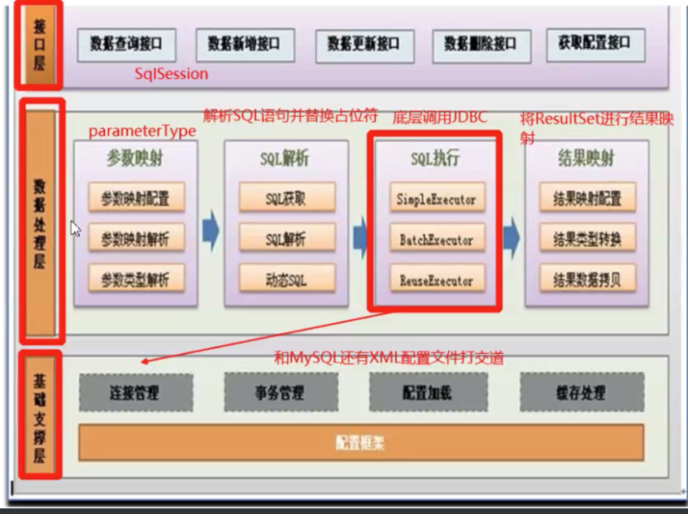

[toc]


## 架构

### 1. 整体架构



### 2.Sql执行流程


#### 四大组件

​	Executor

​	StatementHandler

​	ParameterHander

​	ResultSetHandler

#### Configuration

​	封装了全局配置文件和映射文件中的信息

#### BoundSql

​	组合模式，将解析后的Sql语句和解析出来的参数信息进行封装

#### MappedStatement

​	封装Select/Insert等CRUD标签的信息，包含入参类型信息和输出类型信息等

### 3.Mapper执行流程


## 手写MyBatis框架

### 解析阶段

​	 

​	Resources

​	XmlConfigBuilder:解析全局配置文件，SqlMapper-Config.xml

​		XmlMapperBuilder:解析Mapper.xml文件

​			XMLStatementBuilder:解析mapper.xml文件中CRUD标签

​				XMLScriptBuilder:解析CRUD标签中动态sql语句标签的信息 如：<if><where>等

#### SqlSource

​	包含了CRUD标签中的信息，以及所有SqlNode的信息，通过SqlSource的api去获取最终的一条可执行的sql语句

​	该api最终是通过各个sqlnode处理，处理之后的结果，最后合并成一条sql语句

​	<font color="red">注意：该sql还需要再次进行#{}和${}的处理</font>


#### SqlNode

​	TextSqlNode:包含${}的sql语句

​	StaticTextSqlNode:什么都不带的Sql语句

​	StaticTextSqlNode:什么都不包含的SqlNode

​	IfSqlNode,WhereSqlNode等：包含<if><where>等标签的sqlnode

### 执行阶段

1. 先定访问接口（CRUD操作）

   SqlSession 拥有Configuration对象

   ```java
   <T> T selectOne(String statementId,Object param)  //获取单个对象sql
   <T> List<T> selectList(String statementId,Object param) //获取列表sql
   ```

   selectOne会执行JDBC代码

   ​	需要获取数据源连接（通过Configuration对象去获取connection）

   ​	获取执行的Sql语句 （通过statementId去Configuration对象中获取MappedStatement从而获取Sql语句）

   ​	需要获取入参信息

   ​	需要获取返回值，根据要求获取合适的返回值

2. 通过SqlSessionFactoryBuilder构建SqlSessionFactory

   ```java
   /**
   	*  1.通过输入流获取Configuration对象
   	*  2.然后再生成SqlSessionFactory
   	*/
   SqlSessionFactory factory = SqlSessionFactoryBuilder.build(InputStream is);
   ```

   

3. 使用工厂获取SqlSession,这个工厂就是SqlSessionFactory(Configuration)

   ```java
   //通过SqlSessionFactory.openSesion()方法获取SqlSession
   SqlSession sqlSession = factory.openSession();
   ```

#### Executor

​	用来专门实现JDBC操作的接口

​	CachingExecutor:处理二级缓存

​	<font color="red">BaseExecutor:处理一级缓存</font>

> ​		BaseExecutor中默认包含了一级缓存操作，就是内部有个map存储了sql一级所对应的结果集
>
> ​		如果map中没有对应的结果集，则交由下一级（SimpleExecutor）执行JDBC通过数据库操作后再放入map中

​		<font color="red">SimpleExecutor:执行简单的JDBC操作</font>

​		BatchExecutor:执行批处理的JDBC操作

​		ReuseExecutor:可重复使用的Executor

