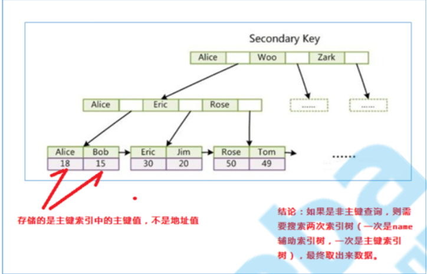

[toc]

### 架构

#### 逻辑架构


##### 解析器(Parser)

1. 先解析from后的语句，再解析select语句，最后order by,limit等

2. 词法分析，行程语法树

3. 从左往右解析(Oracle从右往左解析)

   ``` mysql
   SELECT DISTINCT
       < select_list >
   FROM
       < left_table > < join_type >
   JOIN < right_table > ON < join_condition >
   WHERE
       < where_condition >
   GROUP BY
       < group_by_list >
   HAVING
       < having_condition >
   ORDER BY
       < order_by_condition >
   LIMIT < limit_number >
   ```

   解析顺序是这样的：

   ``` mysql
   -- 行过滤
   1 FROM <left_table>
   2 ON <join_condition>
   3 <join_type> JOIN <right_table> -- 第2步和第3步会循环执行
   4 WHERE <where_condition>				 -- 第4步会循环执行，多个条件执行顺序是从左往右的
   5 GROUP BY <group_by_list>
   6 HAVING <having_condition> -- 列过滤
   7 SELECT
   8 DISTINCT <select_list>
   -- 排序
   9 ORDER BY <order_by_condition> -- MySQL附加
   10 LIMIT <limit_number>查询优化器 (Optimizer)
   ```

##### 查询优化器 (Optimizer)

1. 使用最优的索引

2. 找过滤力度最大的先执行

   ``` mysql
   select * from user where sex='男' and id = 1
   ```

   由于id=1该条件过滤力度大，所以会先执行id=1然后再执行 sex = '男'

3. 多表关联，小表驱动大表

##### 存储引擎 (Pluggable Storage Engines)

###### MyISAM

1. 不支持事务
2. 不支持行锁
3. 读写速度比InnDB高
4. 使用非聚集索引（从而导致不支持事务，及不支持行锁）

###### InnoDB

1. 支持事务
2. 支持行锁
3. 使用聚集索引

|          | Innodb                                                       | MyISAM                                                |
| -------- | ------------------------------------------------------------ | ----------------------------------------------------- |
| 存储文件 | .frm 表定义文件<br/>.ibd 数据文件和索引文件<br/> ibdata 使用**共享表空间存储表数据和索引**信息，所有表使用同一个文件 | .frm 表定义文件 <br/>.myd 数据文件<br/> .myi 索引文件 |
| 锁       | 表锁、行锁                                                   | 表锁                                                  |
| 事务     | 支持                                                         | 不支持                                                |
| CRUD     | 读、写                                                       | 读多                                                  |
| count    | 扫表                                                         | 专门存储的地方(加 where也扫表)                        |
| 索引结构 | B+Tree 聚集索引                                              | B+Tree 非聚集索引                                     |
| 外键     | 支持                                                         | 不支持                                                |

###### Memory

数据存储在内从中，读写性能搞，重启后数据丢失

##### 执行流程


### 索引

#### 存储结构

B+树

1. 高度一般再2-4，树的高度直接影响读写速度
2. 如果是3层结构可以支撑20G数据，4层可以支撑几十T的数据

##### B树


##### B+树


##### 区别

最大区别在于**非叶子节点是否存储数据**

B树是非叶子节点和叶子节点都会存储数据

B+数只有叶子节点才会存储数据，并且数据都是在一行上，而且这些数据会有一个指针指向下一个叶子节点，也就是有序的

#### 非聚集索引(MyISAM)

索引和数据存放再两个不同的文件中，索引通过一个指针指向数据文件中的某条数据

##### 主键索引


##### 辅助索引(次要索引)


#### 聚集索引(InnoDB)

索引和数据在同一个文件中，数据依附在索引的叶子节点中

##### 主键索引


<font color="red">聚集索引中，所有的行数据都依附在索引树上，所以每张表中必须要建索引，如果没建索引，则Mysql会自动为该表建立主键</font>

1. 找唯一字段当主键
2. 自动生成伪劣当主键

因为主键会对数据进行排序，所以

1. 尽量用自增主键
2. 少用联合主键，这样会增加排序难度
3. 少用uuid，这样会增加排序难度
4. 分布式环境下可以使用雪花算法 snowflakes

##### 辅助索引(次要索引)



<font color="red">先通过索引查出主键id，再通过主键索引查询出具体值，这种操作称为回表</font>

##### 索引覆盖

id主键，并在name上加索引

``` mysql
-- 不会回表，因为name索引上原本就存储了id的信息
select id from user where name = 'Alice'
-- 不会回表，同上
select id,name from user where name = 'Alice'
-- 会回表，age没做索引，所以必须通过主键索引id在去查找age信息
select id,name,age from user where name = 'Alice'
```

id主键，并在age，name上建组合索引

``` mysql
-- 不会回表，因为name和age建立了组合索引，所以要查询数据数据都在索引上，就不用根据主键索引再去查数据了
select id,name,age from user where name = 'Alice'
```


