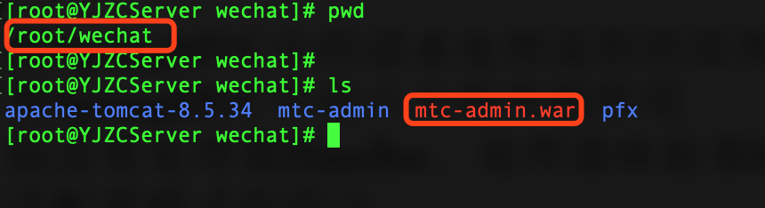
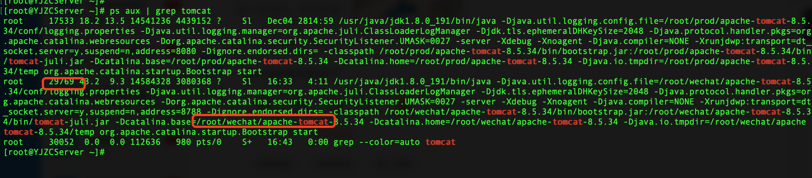

[toc]

## 打包

### idea打包命令

``` 
clean package
```


### 打包完成


## 发布

### 将文件发布至服务器


### 登录到Linux服务器


### 进入程序目录



### 停止tomcat服务

查询tomcat进程

``` 
ps aux | grep tomcat
```



停止tomcat进程

``` 
kill -9 进程号
```

 

### 删除原程序

``` 
cd /root/wechat/mtc-admin
rm -rf *
```


###  将mtc-admin.war复制到mtc-admin目录下

```
cd /root/wechat
mv mtc-admin.war mtc-admin
```


### 进入mtc-admin目录并解压mtc-admin.war

``` 
cd /root/wechat/mtc-admin
unzip mtc-admin.war
```


### 重启tomcat

```
cd /root/wechat/apache-tomcat-8.5.34/bin
./startup.sh ; tail -f ../logs/catalina.out
```


